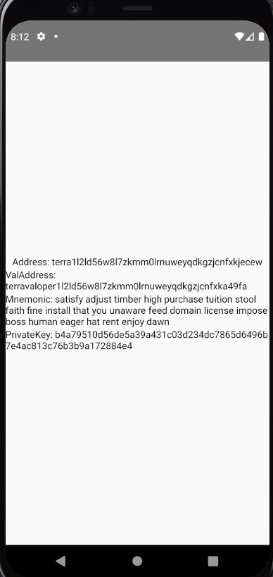

# react-native-mnemonic-key

This library provides `RNMnemonicKey`, a native Android and iOS implementation of Terra.js's `MnemonicKey`, made available for React Native. This significantly improves performance and compatibility in mobile apps.

## Installation

Install to your React Native app's `package.json`:

```sh
$ yarn add react-native-mnemonic-key
```

Futhermore, follow [these instructions](https://github.com/terra-money/terra.js#terrajs-in-react-native) to install terra.js requirements

### Android Setup

You may need to set `multiDexEnabled true` in your Android app's `build.gradle`:

```groovy
// android/app/build.gradle
android {
    ...
    defaultConfig {
        applicationId "com.example.reactnativemnemonickey"
        minSdkVersion rootProject.ext.minSdkVersion
        targetSdkVersion rootProject.ext.targetSdkVersion
        versionCode 1
        versionName "1.0"
        multiDexEnabled true // ADD THIS LINE
    }
}
```

### Adding to iOS

You may need to modify your iOS app's `Podfile` to enable Modular Headers for `TrezorCrypto`.

```ruby
# ios/Podfile
require_relative '../node_modules/react-native/scripts/react_native_pods'
require_relative '../node_modules/react-native-unimodules/cocoapods.rb'
require_relative '../node_modules/@react-native-community/cli-platform-ios/native_modules'

platform :ios, '10.0'

target 'demo' do
  use_unimodules!
  config = use_native_modules!

  use_react_native!(:path => config["reactNativePath"])
  pod 'TrezorCrypto', :modular_headers => true # ADD THIS LINE
end
```

Then run in your React Native iOS app's `ios/` directory:

```sh
$ pod install
```

## Usage

A full example demo app is available inside `/example`.

The usage is nearly identical to Terra.js's `MnemonicKey`, with the exception that `RNMnemonicKey` cannot be instantiated with `new`. You must use the static factory method `RNMnemonicKey.create`, which returns a `Promise<RNMnemonicKey>`.

```ts
// NOT ALLOWED!
// new RNMnemonicKey({ ...options })

// RIGHT WAY
RNMnemonicKey.create({ ...options }).then((rnmk) => terra.wallet(rnmk));
```

## Demo

For your convenience, a full example demo app is provided as a reference inside `/example`.

```sh
# Run iOS Demo
$ yarn example ios

# Run Android Demo
$ yarn example android
```

```tsx
import * as React from 'react';
import { StyleSheet, View, Text } from 'react-native';
import { RNMnemonicKey } from 'react-native-mnemonic-key';

export default function App() {
  const [result, setResult] = React.useState<RNMnemonicKey | undefined>();

  React.useEffect(() => {
    RNMnemonicKey.create({
      mnemonic:
        'satisfy adjust timber high purchase tuition stool faith fine install that you unaware feed domain license impose boss human eager hat rent enjoy dawn',
      coinType: 118,
      account: 5,
      index: 32,
    }).then(setResult);
  }, []);

  return (
    <View style={styles.container}>
      <Text>Address: {result?.accAddress}</Text>
      <Text>ValAddress: {result?.valAddress}</Text>
      <Text>Mnemonic: {result?.mnemonic}</Text>
      <Text>PrivateKey: {result?.privateKey.toString('hex')}</Text>
    </View>
  );
}

const styles = StyleSheet.create({
  container: {
    flex: 1,
    alignItems: 'center',
    justifyContent: 'center',
  },
  box: {
    width: 60,
    height: 60,
    marginVertical: 20,
  },
});
```



## Troubleshooting
```
ERROR    Error: Crypto module not found
ERROR    Invariant Violation: Module AppRegistry is not a registered callable module (calling runApplication)
```
You are missing some requirements for terra.js, follow [these instructions](https://github.com/terra-money/terra.js#terrajs-in-react-native)

## License

This software is licensed under the MIT license. See [LICENSE](LICENSE) for full disclosure.

© 2021 Terraform Labs, PTE.
